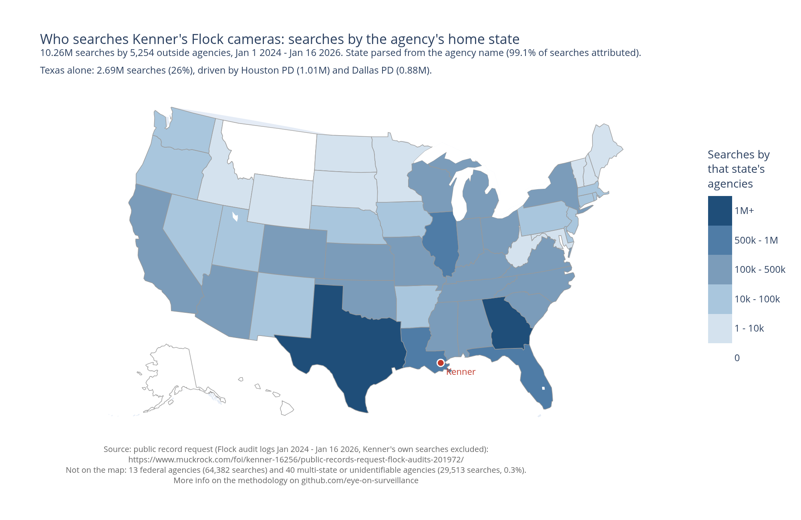

# Usage of Kenner PD Flock Camera. 2024/2025

This is an overview of the data analysis Eye On Surveillance ran over the result of a public records request, focused on the usage of Flock camera in Kenner, LA. 
The raw data, as provided by Kenner PD, is accessible [here](https://www.muckrock.com/foi/kenner-16256/public-records-request-flock-audits-201972/) for your own examination. 
For conveniance, we aggregated the raw data in a small database. Our methodology is described at the root level of this repository. 

The reader can examine how we got there, and redo those graph from scatch himself.

Each visualisation gets a folder with the detailed calculation for that graph.
Inside each folder: a small and self-contained script to generate the graph, the map, or the data-viz.
We try to keep it to basic SQL queries on the SQLite db built by `../setup-scripts/`.

## Internal usage VS network usage

Numbers, interactive version, and methodology: [`internal-vs-network/`](internal-vs-network/)

This graph shows the massive discrepancy between internal queries of those cameras, and external usage, made by police departments. Sometimes very far away.
The ratio is roughly 500k queries per month from the Flock network, to 3 or 4,000 a month from Kenner police department.

## Federal agencies access timeline

Numbers, interactive version, and methodology: [`federal-access-timeline/`](federal-access-timeline/)

13 federal agencies searched Kenner's cameras through the Flock network, including Homeland Security Investigations (175 searches, ending May 1, 2025) and US Border Patrol (209 searches, ending June 23, 2025).
12 of the 13 had stopped by mid-2025.
6 of the 13 accounts are tagged `[Inactive]` in Flock's own export.

The exception is the US Postal Inspection Service: 54,035 searches, still running when the data ends, after an 8-month pause from July 2024 to April 2025.

## Who searches Kenner's cameras: concentration

Numbers, interactive version, and methodology: [`agency-concentration/`](agency-concentration/)

5,254 outside agencies searched Kenner's cameras. Two of them, Houston TX PD (9.8%) and Dallas TX PD (8.6%), account for more searches than the next 48 agencies combined.
The concentration is double-edged: the top 100 agencies represent 51.8% of the 10.26 million outside searches, but the long tail of 5,154 smaller agencies still adds up to 48.2%.

## Where the searches come from

Numbers, interactive version, and methodology: [`searches-by-state/`](searches-by-state/)

Agencies from 47 states plus Washington DC searched Kenner's cameras; only Alaska, Hawaii and Montana never did.
Texas leads by far (2.69M searches, 26%, mostly Houston and Dallas PDs), followed by Georgia (1.09M), Florida, Louisiana and Illinois.
The export has no state column: the state is parsed from the agency's name (two-letter code or full state name), which attributes 99.1% of the searches; the remaining 0.3% are multi-state bodies (regional intelligence centers, railroads, NCMEC) listed in the script's output.
The median agency ran just 221 searches that touched Kenner's cameras over the two years.
