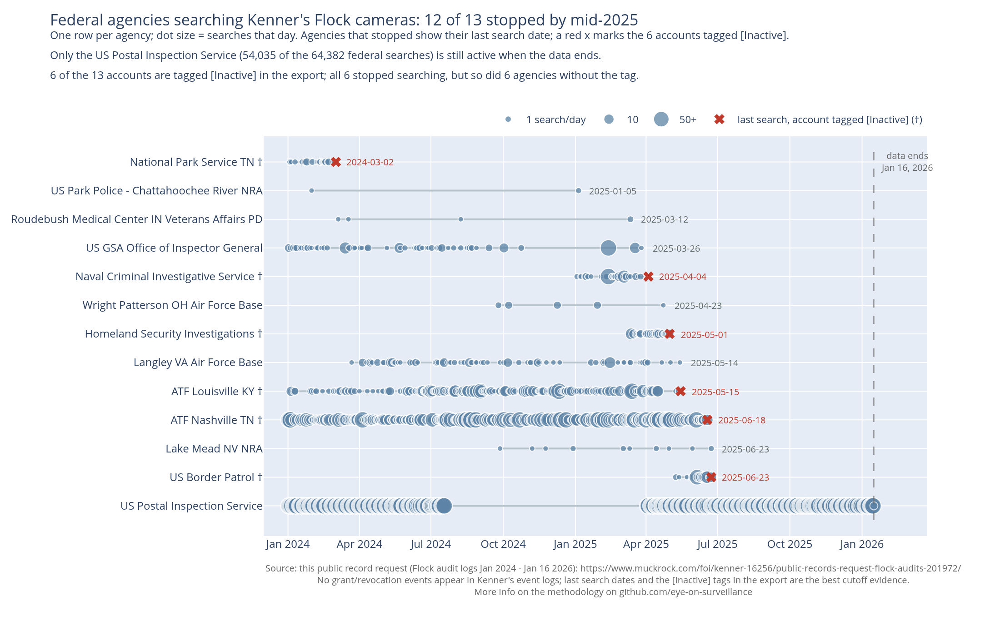
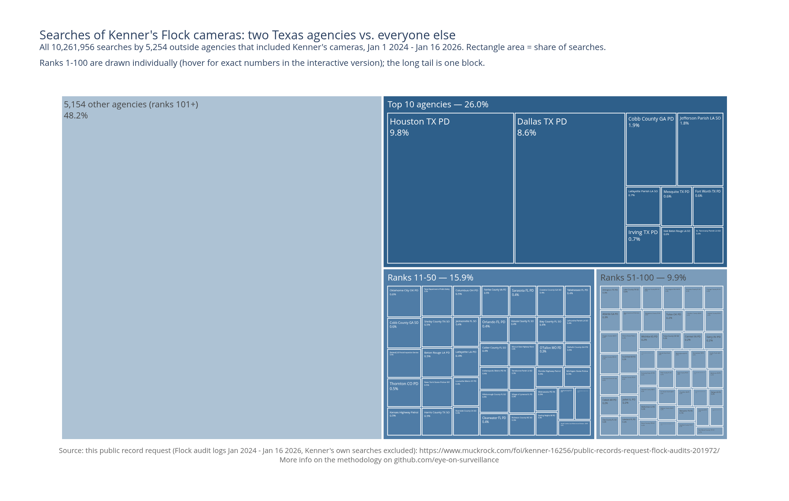

This is an overview of the data analysis we can do, leveraging the aggregated raw data.

Each graph gets a folder with the detailed calculation for that graph.
Inside each folder: a small and hopefully self-contained script to generate the graph, the map, or the data-viz.
We try to keep it to basic SQL queries on the SQLite db built by `../setup-scripts/`.

## Internal usage VS network usage

Numbers, interactive version, and methodology: [`internal-vs-network/`](internal-vs-network/)

This graph shows the massive discrepancy between internal queries of those cameras, and external usage, made by police departments. Sometimes very far away.
The ratio is roughly 500k queries per month from the Flock network, to 3 or 4,000 a month from Kenner police department.

## Federal agencies access timeline

Numbers, interactive version, and methodology: [`federal-access-timeline/`](federal-access-timeline/)

13 federal agencies searched Kenner's cameras through the Flock network, including Homeland Security Investigations (175 searches, ending May 1, 2025) and US Border Patrol (209 searches, ending June 23, 2025).
12 of the 13 had stopped by mid-2025, most in a wave between March and June 2025. 6 of the 13 accounts are tagged `[Inactive]` in Flock's own export; all 6 stopped searching, but so did 6 agencies without the tag.
The exception is the US Postal Inspection Service: 54,035 searches — more than everyone else combined — still running when the data ends, after an unexplained 8-month pause from July 2024 to April 2025.
Kenner's event logs contain no grant or revocation entries for any federal agency, so each agency's last search date is the best available evidence of when its access was cut.

## Who searches Kenner's cameras: concentration

Numbers, interactive version, and methodology: [`agency-concentration/`](agency-concentration/)

5,254 outside agencies searched Kenner's cameras. Two of them, Houston TX PD (9.8%) and Dallas TX PD (8.6%), account for more searches than the next 48 agencies combined.
The concentration is double-edged: the top 100 agencies represent 51.8% of the 10.26 million outside searches, but the long tail of 5,154 smaller agencies still adds up to 48.2%.
The median agency ran just 221 searches that touched Kenner's cameras over the two years.
