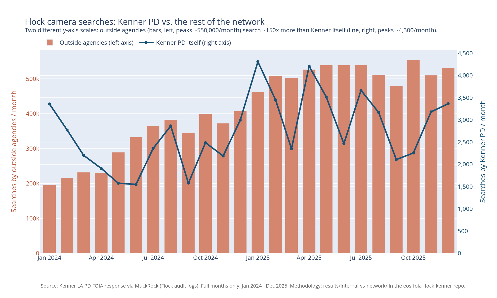

This is an overview of the data analysis we can do, leveraging the aggregated raw data.

Each graph gets a folder with the detailed calculation for that graph.
Inside each folder: a small and hopefully self-contained script to generate the graph, the map, or the data-viz.
We try to keep it to basic SQL queries on the SQLite db built by `../setup-scripts/`.

## Internal usage VS network usage

Numbers, interactive version, and methodology: [`internal-vs-network/`](internal-vs-network/)

This graph shows the massive discrepancy between internal queries of those cameras, and external usage, made by police departments. Sometimes very far away.
The ratio is roughly 500k queries per month from the Flock network, to 3 or 4,000 a month from Kenner police department.
